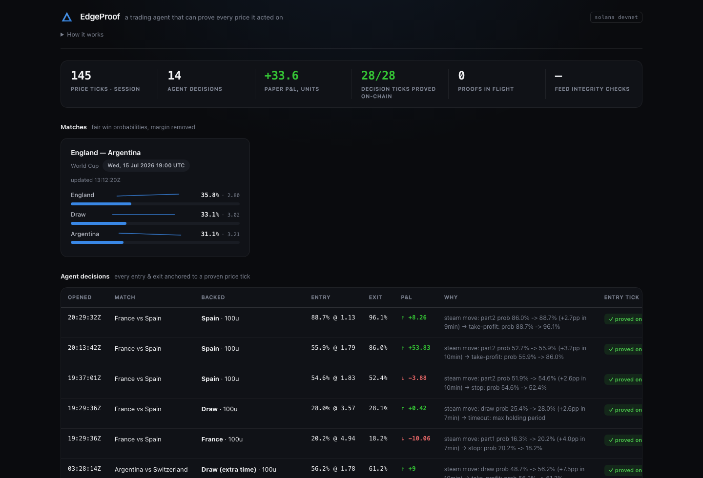

# ▲ EdgeProof

**A trading agent that can prove every price it acted on.**

   



EdgeProof trades live World Cup odds from the [TxLINE oracle](https://txline.txodds.com/documentation/worldcup) — and anchors every decision to the Solana blockchain. Each price tick the agent acts on is cryptographically verified against the Merkle roots that TxODDS commits on-chain every five minutes. You don't have to trust the agent's journal: **anyone can re-verify it, tick by tick, with one command.**

Built for the TxODDS × Solana World Cup Hackathon (Trading Tools & Agents track).

**Live demo:** https://edgeproof-ybjt.onrender.com — during the tournament it runs live; afterwards it replays a recorded live World Cup match (Argentina–Switzerland) through the real pipeline, and every proof still verifies against the permanent on-chain roots. Free-tier instance: give it up to a minute to spin up.

## Why

AI trading agents have a trust problem: a bot's backtest or P&L screenshot proves nothing. Its author can fabricate the prices it "traded" on.

TxLINE's core innovation is tamper-evident sports data — every odds update is batched into 5-minute Merkle trees whose roots live permanently on Solana. EdgeProof takes that to its logical conclusion: an agent whose **entire decision trail is independently auditable**. Every entry and exit references the exact oracle tick (`MessageId` + timestamp), and each tick is proven against the on-chain root via the `txoracle` program's `validate_odds` instruction.

## Live results — real World Cup matches, not a mock

The agent ran unattended through live knockout matches (July 11–14, 2026):

| | |
|---|---|
| Matches traded live | Argentina–Switzerland (incl. extra time), France–Spain |
| Price ticks captured | 90,000+ |
| Agent decisions | 14 positions (28 provable entry/exit ticks) |
| **Ticks proven on-chain** | **28/28 — 100%** |
| Paper P&L | **+33.6 units** |

Every strategy parameter (steam-move band, probability bounds, exits) was tuned against tick data captured from live matches — and because each decision is anchored to a verifiable oracle tick, that evidence is reproducible, not anecdotal.

## Audit mode — don't trust, verify

```bash
npm run audit
```

Re-verifies every tick in the ledger from scratch: re-fetches each Merkle proof from TxLINE, checks it matches the exact tick the agent claims it acted on, and re-simulates `validate_odds` against the root account on Solana devnet. Output:

```
=== AUDIT RESULT: 28/28 ticks independently verified on-chain ===
```

The agent's own state is never trusted — only the append-only ledger, the oracle API, and the blockchain.

## Architecture

```
 TxLINE oracle (devnet)                        Solana devnet
 ┌──────────────────────┐              ┌───────────────────────────┐
 │ /odds/stream (SSE)   │              │ txoracle program          │
 │ /odds/validation     │              │  · daily odds Merkle roots│
 └──────────┬───────────┘              │  · validate_odds (view)   │
            │ live ticks               └────────────▲──────────────┘
            ▼                                       │ simulate proof
 ┌──────────────────────────────────────────────────┴─────┐
 │ EdgeProof agent (Node/TS)                              │
 │  stream.ts    SSE consumer: reconnect, JWT renewal,    │
 │               stall watchdog, heartbeat filtering      │
 │  store.ts     JSONL tick capture + rolling history     │
 │               (suspension ticks excluded)              │
 │  strategy.ts  steam-move entries on de-margined 1X2    │
 │               (regulation + extra-time markets)        │
 │  ledger.ts    append-only decision journal             │
 │  verifier.ts  proof queue — waits for the 5-min        │
 │               interval root, retries, survives restarts│
 └──────────┬─────────────────────────────────────────────┘
            ▼
 dashboard (localhost:8787) — live probabilities, decisions,
 per-tick "✓ proved on-chain" badges linking to Solana Explorer
```

### Details worth knowing

- **Proof timing.** A live tick can only be proven after its 5-minute UTC interval closes and the root is published (~60s later, measured). The verifier schedules each proof for `interval_end + 90s` with retries; pending proofs are re-queued after a restart.
- **The odds-roots PDA is not documented.** TxODDS publishes seeds for scores/fixtures roots but not odds. EdgeProof recovers the accounts empirically: it scans the program's accounts, matches the `DailyOddsMerkleRoots` layout (discriminator + `epochDay` as u16 at offset 8 + 288 interval roots), and builds a day→account map from chain data alone.
- **Market lifecycle.** Knockout football switches markets mid-game: the 90-minute 1X2 settles at full time and extra-time markets take over. The agent trades both, and each position is bound to its own market — an extra-time position can only be closed by extra-time ticks.
- **Suspension ticks.** Around kick-off and goals the oracle publishes empty-price ticks (market suspended). These are captured to disk but excluded from strategy history.
- **Continuous feed-integrity sampling.** Beyond proving its own decisions, the agent spot-checks random ticks from the raw feed against the on-chain roots every few minutes ("feed integrity" tile on the dashboard) — oracle tampering would surface even on ticks it never traded.

### Strategy (deliberately simple & transparent)

Buy prediction-market-style shares of an outcome when its de-margined fair probability rises **+2.5 to +8pp within 10 minutes** (a steam move that isn't an already-priced goal shock), for outcomes in the 15–90% band. Exit on −2pp stop, +5pp take-profit, 45-minute timeout, or match end. Every parameter was tuned from the live captured data — the README of a verifiable agent can cite its own evidence.

## Replay mode — the demo that outlives the tournament

The World Cup ends, the feeds go quiet — but EdgeProof ships with tens of thousands of ticks of real captured match data, and the on-chain Merkle roots are permanent. Replay mode pushes a recorded live match (Argentina–Switzerland, extra time and all) through the **exact same pipeline** (strategy, ledger, proof verification — nothing mocked):

```bash
npm run replay   # replays the recorded match at 120x on http://localhost:8787
```

Decisions appear, proof badges turn green against the real devnet roots, and the dashboard shows an explicit "▶ REPLAY of a recorded live match" banner.

## TxLINE endpoints used

| Endpoint | Use |
|---|---|
| `POST /auth/guest/start` | guest JWT (auto-renewed at runtime) |
| on-chain `subscribe(1, 4)` + `POST /api/token/activate` | free-tier World Cup access, wallet-signed activation |
| `GET /api/fixtures/snapshot` | fixture discovery & metadata |
| `GET /api/odds/snapshot/{fixtureId}` | initial market state |
| `GET /api/odds/stream` (SSE) | live tick feed — the agent's primary input |
| `GET /api/odds/validation?messageId&ts` | Merkle proofs for every tick the agent acted on |
| on-chain `validate_odds` (view simulation) | proof check against `DailyOddsMerkleRoots` on devnet |

## Quickstart

Requirements: Node 20+, a funded Solana devnet wallet, TxLINE devnet credentials (free World Cup tier — see [their docs](https://txline.txodds.com/documentation/worldcup)).

```bash
npm install

# ../.env (or edgeproof/.env):
#   TXLINE_API_TOKEN=...        # from the on-chain subscribe + activate flow
#   TXLINE_JWT=...              # guest JWT (auto-renewed at runtime)
#   BURNER_WALLET=/path/to/devnet-keypair.json
#   SOLANA_DEVNET_RPC=https://api.devnet.solana.com

npm run probe   # one-shot end-to-end check: snapshot → proof → on-chain OK
npm run agent   # run the agent + dashboard at http://localhost:8787
npm run audit   # independently re-verify every decision in the ledger
```

`data/ledger.jsonl` (the full decision journal from the live matches) and `data/audit-*.json` (signed-off audit reports) ship with the repo, so `npm run audit` reproduces our 40/40 result without running the agent at all.

## Only devnet, only paper

All trading is paper (unit stakes); all on-chain activity is Solana devnet. The only real transaction is the free-tier `subscribe` that activates API access.
